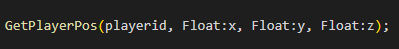
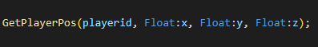

# Change Log

## 0.0.2

- Добавлена иконка для расширения

## 0.0.4

- Исправлено отображение одинарных кавычек
- Исправлено подсвечивание функций с телом в одну строку
- Исправлено подсвечивание оператора new в циклах и функциях

## 0.0.5

- Обновлена иконка расширения
- Удалены ненужные снипеты

## 0.0.6

- Добавлен snippet "однострочный цикл for". Ключевое слово 'for'
- Исправлен snippet "#include once"
- Добавлена подсветка передаваемых аргументов в функции при её вызове

## 0.0.7

- Исправлено отображение комментариев в switch конструкции
- Исправлена подсветка синтексиса в case и default конструкциях без фигурных скобок
- Добавлена подсветка для дипазонов значений (Пример: 1..3)
- Добавлена подсветка для IP адресов

## 0.0.8

- Исправлена критическая ошибка связанная с одинарными кавычками (') в case
- Строки начинающиеся с " и ' разделены на различные токены

## 0.0.10

- Исправлены некоторые ошибки с подсветкой инициализации переменных внутри параметров функций

Old:

New:

- Исправлена подсветка тегов переменных при добавлении пробелов между тегом и ":"

| Old    |  |
| -------- | ------- |
| **New**  |     |

## 0.0.13

- Исправлено отобрадение параметров функции. Ранее при наличие массивов-параметров ломалась подсветка
- Оптимизированна подсветка массивов

## 0.0.14

- Исправлена подсветка констант языка (true, false, EOS) в вызове функций
- Исправлено подствека sizeof в массивах

## 0.0.16

- Добавлена подсветка директив препроцессора #error и #warning 
- Исправлена подсветка вызовов функций. Ранее если между названием функции и круглыми скобками её параметров стоял пробел подсветка отключалась
- Исправлено отображение подсветки директив препроцессора в конструкциях switch-case

## 0.0.17
- Начало работы над улучшением работы IntelliSense с расширением (Пример: OnPlayerConnect)
- Исправление некоторых недочётов

## 0.1.0
- Все объявленные в файле define теперь будут предлагаться IntelliSense. К сожалению список define пока обновляется только при открытии файла и доступны только в этом же файле. 

## 0.2.0
Для расширения был написан парсер pawn кода, составляющий AST для файлов. Что позволило создать некий анализатор pawn кода. Что теперь может расширение:
> - Нахождение и подсветка ошибок:
>> - Некоторые синтаксические ошибки
>> - Вызов неизвестных функций
>> - Обращение к неизвестным переменным
> - Добавление всех функций, процедур и define'ов в IntelliSense. Также при выборе функции из IntelliSense сразу будут подставляться либо аргументы по умолчанию, либо название аргументов из заголовка функциию. Если выбирается public, то автоматически будут добавлятся его аргумента, а также скобки ({})
> - Проверка наличия включаемых файлов (include). Стабильная работа возможно только в том случае, если в редакторе открыта рабочая папка, в которой будет находится папка pawno с вложенной папкой include

	!!!Предупреждение!!!
	Пока возможны многочисленные ошибки в работе. Просим 	сообщать о найденных ошибках. 
	Так же расширение может пролагивать особенно работая с большими файлами или многочисленными инклудами. Мы работаем над оптимизацией. Если у Вас возникнула проблема, сообщите нам.

