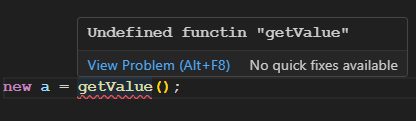
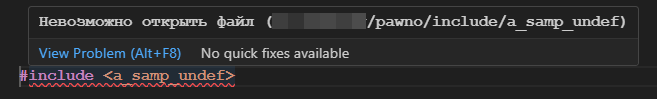
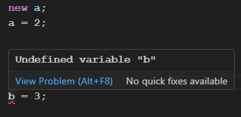

# Pawn Language

Расширение для поддержки в VSCode языка программирования Pawn (SA:MP)

## Реализованные функции

Расширение включает в себя:
- Синтаксическую подсветку кода для языка программирования Pawn
- Несколько быстрых вводов фрагментов кода (snipets) 

## Планы

### Уже на подходе:
- Подсветка SQL синтаксиска в строках с запросами

### Перспективы:
- Семантическая подсветка кода
- Автодополнение
- Анализ кода
- Обработка команд препроцессора
- Автонастройка компилятора и настроек рабочей папки
- Поддержка Intellisense

### Скриншоты наработок

